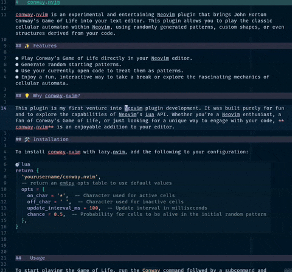

# ⚛️ conway.nvim



**conway.nvim** is an experimental and entertaining Neovim plugin that brings John Horton Conway’s Game of Life into your text editor. This plugin allows you to play the classic cellular automaton within Neovim, using randomly generated patterns, custom shapes, or even structures derived from your code.

## ✨ Features

- Play Conway’s Game of Life directly in your Neovim editor.
- Generate random starting patterns.
- Use your currently open code to treat them as patterns.
- Enjoy a fun, interactive way to take a break or explore the fascinating mechanics of cellular automata.

## 💡 Why conway.nvim?

This plugin is my first venture into Neovim plugin development. It was built purely for fun and to explore the capabilities of Neovim’s Lua API. Whether you’re a Neovim enthusiast, a fan of Conway’s Game of Life, or just looking for a unique way to engage with your code, **conway.nvim** is an enjoyable addition to your editor.

## 🛠️ Installation

To install **conway.nvim** with lazy.nvim, add the following to your configuration:

```lua
return {
  'yourusername/conway.nvim',
  -- return an emtpy opts table to use default values
  opts = {
    on_char = '*',  -- Character used for active cells
    off_char = ' ',  -- Character used for inactive cells
    read_off_char = ' ' -- Off state character to read from
    update_interval_ms = 100,  -- Update interval in milliseconds
    chance = 0.5,  -- Probability for cells to be alive in the initial random pattern
  },
}
```

## ▶️ Usage

To start playing the Game of Life, run the `Conway` command follwed by a subcommand and enjoy. Use
e.g. `CTRL-O` to go back to where you came from or close the scratch the way you want.

### ⚙️ Subcommands

**conway.nvim** comes with a variety of subcommands that enhance your experience. Here is a detailed list of the available subcommands:

- `:Conway random`: Starts the Game of Life with a randomly generated pattern.
- `:Conway from_current`: Uses the current buffer's content to generate an initial pattern.
- `:Conway new_grid`: Creates a new, empty grid for custom pattern design.
- `:Conway anonymize`: Obscures any identifiable text in the current grid, making it more abstract.
- `:Conway pause`: Pauses the ongoing simulation.
- `:Conway resume`: Resumes a paused simulation.
- `:Conway destroy`: Stops the current simulation and clears the grid.

## 📚 Contributing

Contributions, feedback, and feature requests are welcome! Feel free to submit issues or pull requests on [GitHub](https://github.com/thejezzi/conway.nvim).

## 📓 License

This project is licensed under the MIT License. See the [LICENSE](LICENSE) file for more details.
